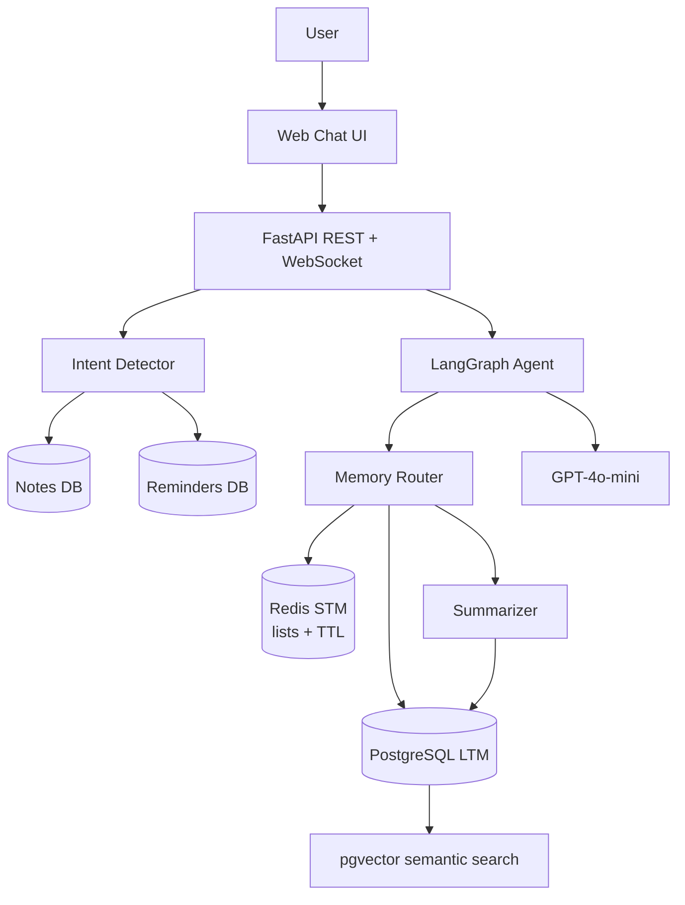

# Life-OS — Personal AI Assistant with Persistent Memory

Portfolio-grade FastAPI + LangGraph personal assistant that remembers users across sessions, manages notes and reminders, and detects user intent from natural language. It uses Redis for short-term session memory, PostgreSQL + pgvector for durable semantic memory, and OpenAI models when an API key is configured. Without an API key, it falls back to deterministic local responses so the demo still runs.

## Architecture



## Features

- **Persistent Memory**: Remembers user facts, preferences, and goals across sessions.
- **Notes System**: Full CRUD for personal notes with search, pinning, and tagging.
- **Reminders System**: Create, list, complete, and track reminders with priority and due dates.
- **Natural Language Intent Detection**: Say "save a note" or "remind me to" in chat and the system acts automatically.
- **Web Chat UI**: Beautiful dark-mode chat interface at the root URL.
- **Dual Memory Architecture**: Redis for fast session context, PostgreSQL + pgvector for durable semantic search.
- **Token Optimization**: TOON-style context compression instead of raw JSON history.
- **Observability**: Prometheus metrics, JSON logs, LangSmith trace hooks.

## Quickstart

```powershell
Copy-Item .env.example .env -Force
docker compose up --build
```

Open `http://127.0.0.1:8000` for the Chat UI, or `http://127.0.0.1:8000/docs` for the API docs.

For local Python development:

```powershell
python -m venv .venv
.\.venv\Scripts\Activate.ps1
python -m pip install -e ".[dev]"
pytest
```

## Demo Flow

1. Open `http://127.0.0.1:8000` in your browser.
2. Enter a user ID (e.g. `demo-user`) and click **Start Session**.
3. Try these messages:
   - `My name is Aman and I prefer quiet developer tools.`
   - `Save a note: my AWS account ID is 123456789012.`
   - `Remind me to review the pull request by end of day.`
   - `What do you remember about me?`
4. Click **End Session** to trigger memory consolidation.
5. Start a new session with the same user ID — the agent remembers you.

## API

### Sessions & Chat
- `GET /health`
- `POST /api/v1/sessions`
- `POST /api/v1/sessions/{session_id}/chat`
- `GET /api/v1/sessions/{session_id}/history`
- `DELETE /api/v1/sessions/{session_id}?user_id=...`
- `WS /api/v1/sessions/{session_id}/chat/ws?user_id=...`

### Memory
- `GET /api/v1/users/{user_id}/memory`
- `DELETE /api/v1/users/{user_id}/memory`

### Notes
- `POST /api/v1/notes`
- `GET /api/v1/notes?user_id=...&q=...`
- `GET /api/v1/notes/{note_id}`
- `PATCH /api/v1/notes/{note_id}`
- `DELETE /api/v1/notes/{note_id}`

### Reminders
- `POST /api/v1/reminders`
- `GET /api/v1/reminders?user_id=...&include_completed=false`
- `GET /api/v1/reminders/due?user_id=...`
- `GET /api/v1/reminders/{reminder_id}`
- `PATCH /api/v1/reminders/{reminder_id}`
- `DELETE /api/v1/reminders/{reminder_id}`

## Token Optimization

The agent injects memory in a compact TOON-style structure instead of raw JSON:

```text
[SESSION_RECENT]
user: ...
assistant: ...
[/SESSION_RECENT]

[USER_FACTS]
- User prefers quiet developer tools.
[/USER_FACTS]
```

Measured token reduction numbers will be added once the OpenAI-backed flow is benchmarked.

## Observability

- `/metrics` is exposed through `prometheus-fastapi-instrumentator`.
- Logs are JSON-ready through `structlog`.
- LangSmith env vars are documented in `.env.example` for agent trace demos.

## Roadmap

See [Project Plan](docs/PROJECT_PLAN.md) and [Implementation Backlog](docs/IMPLEMENTATION_BACKLOG.md).
